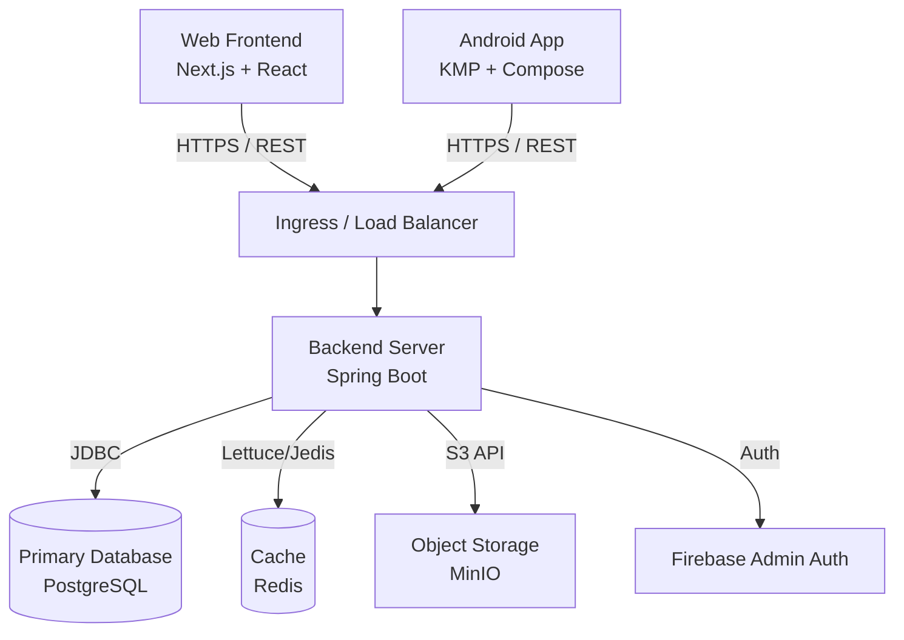

# CalorieTrackorApplication

This repository contains the full stack implementation of the Calorie Trackor Application.

## Architecture Documentation

This section outlines both the High-Level Design (HLD) and Low-Level Design (LLD) of the application, detailing the system's architecture, components, and data flow.

---

## 1. High-Level Design (HLD)

The system follows a standard modern Client-Server and Microservices-oriented architecture using a Java Spring Boot backend, a Next.js web application, and an Android client.

### System Architecture Diagram

### Typical Request Flow (Example: Logging a Meal)
1. **User Action (UI):** The user fills out the meal logging form in the Next.js Frontend (`frontend/src/app/log-meal/page.tsx`) or Android App and submits it.
2. **API Request:** The client sends an HTTP POST request containing the meal details (and JWT token) to the backend API via Axios/Ktor.
3. **Authentication Filter:** The Spring Security `JwtAuthenticationFilter` intercepts the request, verifies the JWT token (and optionally checks via Firebase Admin), and sets the security context.
4. **Controller Routing:** The `MealController.java` receives the validated request mapped to `/api/meals`.
5. **Business Logic:** The `MealService.java` processes the DTO, maps it to a `Meal` entity, calculates nutritional value (using caching from `FoodAnalysisCacheRepository` if AI analysis is needed), and associates it with the authenticated user.
6. **Data Persistence:** The `MealRepository.java` saves the meal details into the PostgreSQL database.
7. **Response:** The backend returns a mapped `MealResponse` DTO to the client.
8. **UI Update:** The client updates the user's dashboard to reflect the newly logged calories.

---

## 2. Low-Level Design (LLD) & Detailed Project Structure

### 2.1 Backend Server (Java Spring Boot)

The backend follows the **N-Tier Layered Architecture**. Below is the detailed structure of `backend/src/main/java/com/calorie/tracker/`:

- **`controller/`**: REST API endpoints mapping incoming HTTP requests to business logic.
  - `AuthController.java`: Handles user login and registration.
  - `MealController.java`, `WaterController.java`, `WeightController.java`: Manage core tracking entities.
  - `AIController.java`, `FoodController.java`, `IndianFoodController.java`: AI integrations and food catalog search.
  - `AnalyticsController.java`: Aggregates data for charts and dashboards.
  - `MediaController.java`: Handles uploads/downloads of images to MinIO.
  - `NotificationController.java`: Handles user alerts.
- **`service/`**: Core business logic and transaction management.
  - `AuthService.java`: JWT generation and validation.
  - `MealService.java`, `WaterService.java`, `WeightService.java`: CRUD operations and business rules.
  - `GeminiVisionService.java`, `GeminiFoodInfoService.java`: External AI service integrations.
  - `S3Service.java`: MinIO object storage operations.
  - `AnalyticsService.java`: Aggregates usage data.
- **`repository/`**: Spring Data JPA interfaces for database interaction.
  - `UserRepository.java`, `MealRepository.java`, `WaterRepository.java`, `WeightLogRepository.java`.
  - `FoodInfoRepository.java`, `IndianFoodRepository.java`.
  - `AiRequestRepository.java`, `FoodAnalysisCacheRepository.java`.
- **`model/` (Entities):** JPA definitions mapping to database tables.
  - Core tables: `User.java`, `Meal.java`, `WaterLog.java`, `WeightLog.java`, `FastingLog.java`.
  - Catalog tables: `FoodItem.java`, `IndianFood.java`, `FoodInfo.java`.
  - Enums: `GoalType.java`, `MealType.java`, `Role.java`, `Lifestyle.java`.
- **`dto/`**: Data Transfer Objects to shape API inputs/outputs.
  - `AuthRequest.java`, `RegisterRequest.java`, `MealRequest.java`, `MealResponse.java`, etc.
- **`security/`**: Configuration and filters for securing the application.
  - `SecurityConfig.java`: Spring Security filter chains and CORS configuration.
  - `JwtAuthenticationFilter.java`: Intercepts and parses JWT tokens from requests.
  - `CustomUserDetailsService.java`: Loads user details for security contexts.
- **`config/`**: Global configurations and startup seeders.
  - `OpenApiConfig.java`: Swagger UI setup.
  - `FirestoreConfig.java`: Firebase integration.

### 2.2 Frontend Web (Next.js & React)

The web frontend utilizes the **Next.js App Router** structure located in `frontend/src/`:

- **`app/` (Pages and Routing):**
  - `layout.tsx` & `globals.css`: Global layout wrapper and CSS resets.
  - `page.tsx`: Landing page.
  - `auth/login/page.tsx`, `auth/register/page.tsx`: Authentication flows.
  - `dashboard/page.tsx`: Main user dashboard for daily summaries.
  - `log-meal/page.tsx`, `water/page.tsx`, `weight/page.tsx`: Pages for logging tracking metrics.
  - `analytics/page.tsx`: Visualization charts.
  - `profile/page.tsx`: User profile management.
  - `ai/page.tsx`: AI food analysis interface.
- **`components/`**: Reusable UI elements.
  - `Navbar.tsx`: Top navigation bar.
  - `ClientLayout.tsx`: Wraps layout logic dependent on the window/client.
- **`context/`**: React Context for global state management.
  - `AuthContext.tsx`: Manages user session tokens and logged-in state across the application.
- **`lib/`**: Utility functions and configurations.
  - `api.ts`: Centralized Axios instance configuration for backend communication.

### 2.3 Mobile Client (Android)

Built using **Kotlin Multiplatform (KMP) & Jetpack Compose**. The structure inside `android/`:

- `composeApp/`: Contains the primary shared UI logic and Android specific implementations.
- `build.gradle.kts` & `settings.gradle.kts`: Gradle build scripts configuring Compose, KMP, and Google Services.

---

## 3. Infrastructure & Deployment

- **Containerization:** The `backend` provides a `Dockerfile`, and the whole stack can be spun up using `docker-compose.yml` which configures:
  - Spring Boot App
  - PostgreSQL Database
  - Redis Cache
  - MinIO Storage
- **Kubernetes:** The `k8s/` directory contains manifests (`backend.yaml`) to deploy the application as a Deployment and Service into a Kubernetes cluster.
- **Testing Scripts:** Included in the root to test endpoints:
  - `test_all_apis.sh`, `test_comprehensive.sh`, `test_full_flow.sh`, `generate_tests.py`
